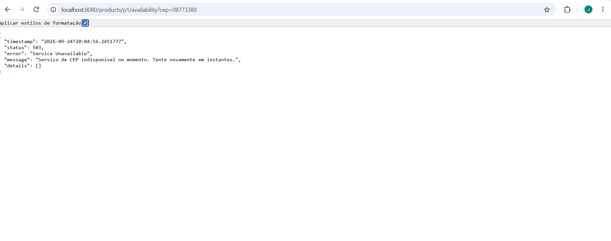
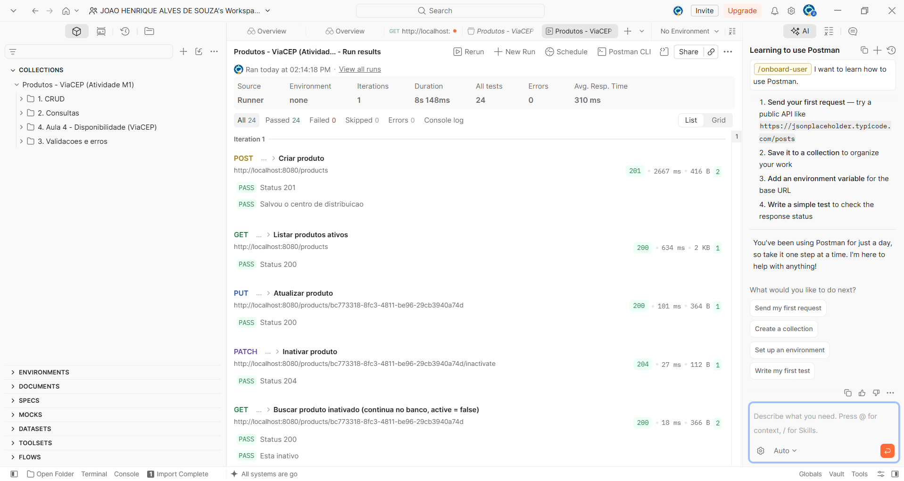

# API de Produtos + ViaCEP

Atividade M1 — Java Spring Fundamentals. API REST de produtos (CRUD, validações, filtros) com integração à ViaCEP para verificar se um produto está disponível na cidade de um CEP.

## Tecnologias

Java 21 · Spring Boot 3.5 · Spring Data JPA · PostgreSQL · Flyway · Bean Validation · RestClient

## Como rodar

1. Suba um PostgreSQL com um banco `produtos_db` (usuário `postgres`, senha `postgres`, porta 5432).
   Com Docker, basta: `docker compose up -d`
2. Rode a aplicação: `./mvnw spring-boot:run` (ou pelo IntelliJ, na classe `ProdutosApplication`).
3. O Flyway cria a tabela e os 10 produtos iniciais (`p1` a `p10`) automaticamente.

Outras credenciais podem ser passadas por variáveis de ambiente: `DB_URL`, `DB_USERNAME`, `DB_PASSWORD`.

## Endpoints

| Método | URL | Descrição |
| --- | --- | --- |
| POST | `/products` | Cria produto (header `X-User` + body JSON) |
| GET | `/products` | Lista produtos ativos |
| GET | `/products?category={categoria}` | Filtra por categoria |
| GET | `/products/top5` | Top 5 produtos por preço |
| GET | `/products/{id}` | Busca por id |
| PUT | `/products/{id}` | Atualiza produto |
| PATCH | `/products/{id}/inactivate` | Inativa produto (exclusão lógica) |
| GET | `/products/{id}/availability?cep={cep}` | Verifica se o produto está disponível na cidade do CEP |

### Exemplo — disponibilidade

`GET /products/p1/availability?cep=08773380`

```json
{
  "productId": "p1",
  "cep": "08773380",
  "city": "Mogi das Cruzes",
  "distributionCenter": "Mogi das Cruzes",
  "available": true
}
```

| Situação | Status |
| --- | --- |
| Cidade do CEP = centro de distribuição | 200, `available: true` |
| Cidade diferente | 200, `available: false` |
| CEP mal formatado | 400 |
| CEP inexistente | 404 |
| Produto inexistente | 404 |
| ViaCEP fora do ar ou lenta (timeout de 3 s) | 503 |

## Resiliência na integração com a ViaCEP

A ViaCEP é um serviço externo e pode falhar. O `ViaCepService` trata cada cenário sem derrubar a aplicação:

- **CEP mal formatado** (ex.: `123`, `abc12345`): validado antes da chamada externa → **400**, sem gastar requisição à ViaCEP.
- **CEP inexistente** (ex.: `99999999`): a ViaCEP responde 200 com `{"erro": "true"}`; o serviço confere esse campo → **404**.
- **ViaCEP fora do ar, lenta ou sem internet**: timeout de 3 s (`viacep.timeout-ms`) + captura de `RestClientException` → **503** com mensagem amigável; o erro técnico fica no log. O restante da API continua funcionando normalmente.

### Como simular a ViaCEP fora do ar

A URL da ViaCEP pode ser trocada pela variável de ambiente `VIACEP_URL`, sem editar nenhum arquivo. Aponte para um endereço inexistente e suba a aplicação:

```powershell
# Windows (PowerShell)
$env:VIACEP_URL="https://viacep-fora-do-ar.invalid"; ./mvnw spring-boot:run
```

```bash
# Linux / macOS
VIACEP_URL=https://viacep-fora-do-ar.invalid ./mvnw spring-boot:run
```

Depois chame `GET /products/p1/availability?cep=08773380`. A resposta esperada é:

```json
{
  "status": 503,
  "error": "Service Unavailable",
  "message": "Serviço de CEP indisponível no momento. Tente novamente em instantes.",
  "details": []
}
```



Enquanto isso, `GET /products` continua respondendo 200, o que mostra que a falha externa fica isolada.

## Postman

A collection está em `postman/Produtos-ViaCEP.postman_collection.json`. Importe no Postman e use **Run collection** para executar todos os testes.


